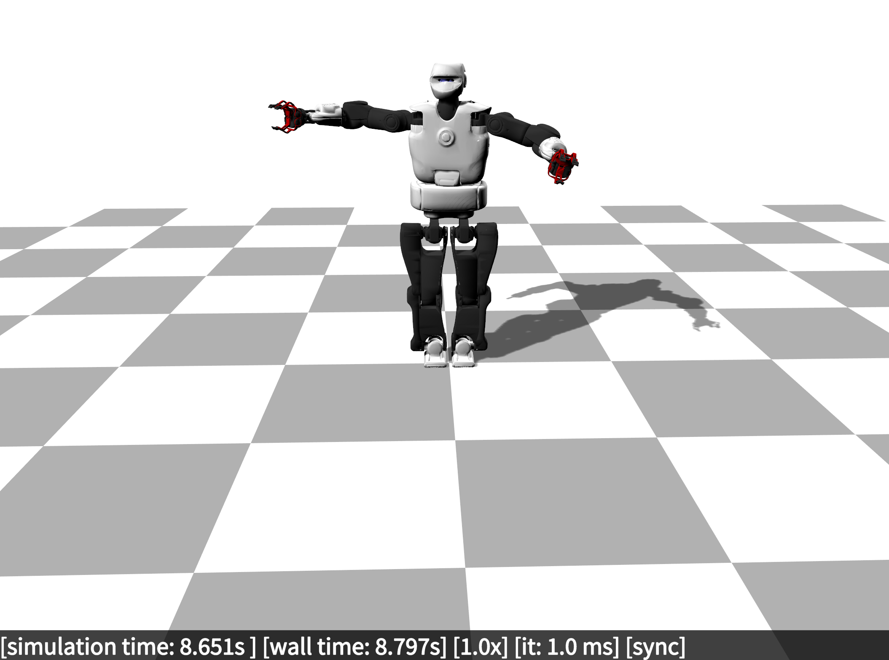

# Summary

Robot simulation plays a pivotal role in robotics and machine learning research, offering a cost-effective and safe means to develop, validate, and benchmark algorithms in various scenarios. With the growing complexity of robotic systems and the increasing demand for data-driven approaches in machine learning, there is a pressing need for versatile and efficient robot simulators that cater to the diverse requirements of researchers. In response to this demand, we introduce RobotDART, a high-performance and modular robot simulator designed to empower researchers in robotics and machine learning with a powerful and flexible simulation environment.

{ width=90% }

# Motivation
Simulators play a crucial role in robotics by providing a safe environment for testing without the risk of damaging real robots. Within the robotics community, existing simulators primarily prioritize seamless deployment on physical robots, which is evident in their design philosophy. One of the best examples is [Gazebo](https://gazebosim.org) (@koenig2004design), which is typically accessed through ROS, as an abstraction level, so that users can seamlessly transition between simulated and real robots. Because of this design choice, Gazebo: (1) is mostly asynchronous, which means that the simulator operates on its own clock and time-step analogous to real-world robots, (2) introduces a significant overhead, including network communication and serialization to topics/services/messages, and (3) is not designed for running multiple simulations concurrently or even sequentially. At a lower abstraction level, the robotics community has developed various physics libraries such as Mujoco (@todorov2012mujoco), Bullet (@bullet), and ODE (@smith2005open). However, these libraries typically lack sensor abstractions, particularly for cameras, and do not come with pre-validated robot models, necessitating users to program their own simulators.

With the emergence of reinforcement learning for robot control and more generally robot learning, there arises a need for simulators that can address novel requirements not adequately addressed by current simulators or "low-level" physics libraries. Specifically, simulators designed for robot learning must encompass the following features:

- beyond real-time simulation speed: Given the necessity to execute thousands or even millions of simulations, both controllers and simulators stand to benefit from operating at speeds faster than real-time;
- overhead-free and fast reset: with the imperative to conduct numerous simulations efficiently, minimizing time introduced by the communication overheads and the initialization processes becomes paramount;
- synchronous operation: ensuring reproducible learning runs and effectively managing faster-than-reality simulations necessitates synchronization of simulation and controller time-steps;
- thread safety: modern computers with their many of cores can be leveraged to execute many simulations in parallel but the simulator needs to be designed in accordance;
- camera and depth sensor simulation: deep reinforcement learning has demonstrated promising results in learning vision-based policies through end-to-end learning; however, this demands the simulation of both depth and color cameras;
- ease of use, flexibility and modularity: the field of machine learning is characterized by rapid development, making it challenging to anticipate the diverse needs of researchers; for instance, techniques like privileged reinforcement learning (@lee2020learning) and domain randomization (@tobin2017domain) necessitate direct access to various low-level components of the simulator to enable experimentation and innovation.

Most of these features are not implemented in the mainstreams robot simulators like Gazebo. Even if some of these features are implemented, they require too much work from the researcher. For example, to effectively use Gazebo for multi-core parallel simulations, we need to create multiple Gazebo servers with different ip addresses which need to be unique in the LAN and propagated to the correct thread; as a result, the researcher spends a lot of time in boilerplate code to handle this instead of focusing in their main research avenue. RobotDART aims at filling this gap by providing a flexible simulator for data-driven robotics while being open-source and as simple as possible.

# Design and Implementation

RobotDART is built upon the Dynamic Animation and Robotics Toolkit (DART) (@lee2018dart), a robust open-source physics engine known for its accuracy and efficiency in simulating rigid body dynamics and articulated systems. By leveraging DART's capabilities, RobotDART provides a solid foundation for simulating a wide range of robotic systems with realistic dynamics and interactions with the environment.

One of the key strengths of RobotDART lies in its modular architecture, which allows researchers to easily customize and extend the simulator according to their specific research needs. RobotDART provides a collection of pre-built robot models, sensors, and environments, covering a diverse range of scenarios commonly encountered in robotics research. Researchers can seamlessly integrate their own robot models, sensors, and environments into RobotDART, thanks to its flexible library design and intuitive Python API.

Unlike other simulation frameworks, like Gazebo, RobotDART runs headless by default, and there is the possibility of rendering the scene (e.g., through a camera sensor) without opening a graphics window. All RobotDART's code is thread-safe (including graphics and camera sensors), and thus enables its users to use their code in parallel jobs in multicore computers. RobotDART is intended to be used by Robotics and Machine Learning researchers who want to write controllers or test learning algorithms without the delays and overhead that usually comes with other simulators (e.g., Gazebo, Coppelia-sim).

**Main features:**

- High-performance simulation engine based on the DART physics engine.
- Support for various robot platforms, including manipulators, mobile robots, and humanoid robots.
- Extensive library of sensors, such as cameras, lidars, and inertial measurement units.
- Modular environment system for creating custom simulation scenarios.
- Intuitive Python API for easy integration with machine learning frameworks such as TensorFlow and PyTorch.
- Modular graphics API for easily creating custom render pipelines.
- Thread-safe code that enables parallelization without worries.

# RobotDART in Scientific Works

RobotDART has been actively used in many scientific research projects and publications within the domains of robotics, robot learning, reinforcement learning, evolutionary computation and artificial intelligence.

## Research Projects

1. H.F.R.I. project [NOSALRO](https://nosalro.github.io/), PI: Konstantinos Chatzilygeroudis, 2022-2025
1. UKRI project [RoboHike](https://rpl-as-ucl.github.io/RoboHike/), PI: Dimitrios Kanoulas, 2022-2025
1. EPSRC project [REcoVER](https://www.imperial.ac.uk/adaptive-intelligent-robotics/), PI: Antoine Cully, 2020-2022
1. ERC Starting Grant project [Resibots](https://resibots.eu/), PI: Jean-Baptiste Mouret, 2015-2020
1. H2020 project [AnDy](https://andy-project.eu/), PI: Daniele Pucci, 2017-2021

## Scientific Publications (indicative list, ordered by date)

1. Anne, T. and Mouret, J.B., 2024. Parametric-Task MAP-Elites. arXiv preprint arXiv:2402.01275. [(pdf)](https://arxiv.org/pdf/2402.01275)

1. Ivaldi, S. and Ghini, E., 2023, June. Teleoperating a robot for removing asbestos tiles on roofs: insights from a pilot study. In 2023 IEEE International Conference on Advanced Robotics and Its Social Impacts (ARSO) (pp. 128-133). IEEE. [(pdf)](https://ieeexplore.ieee.org/iel7/10187190/10187410/10187476.pdf)

1. Khadivar, F., Chatzilygeroudis, K. and Billard, A., 2023. Self-correcting quadratic programming-based robot control. IEEE Transactions on Systems, Man, and Cybernetics: Systems. [(pdf)](https://infoscience.epfl.ch/record/301975/files/Self_Correcting_Quadratic_Programming_based_Robot_Control_IEEE_SMCA.pdf)

1. Souza, A.O., Grenier, J., Charpillet, F., Maurice, P. and Ivaldi, S., 2023, June. Towards data-driven predictive control of active upper-body exoskeletons for load carrying. In 2023 IEEE International Conference on Advanced Robotics and Its Social Impacts (ARSO) (pp. 59-64). IEEE. [(pdf)](https://ieeexplore.ieee.org/iel7/10187190/10187410/10187548.pdf)

1. Chatzilygeroudis, K.I., Tsakonas, C.G. and Vrahatis, M.N., 2023, July. Evolving Dynamic Locomotion Policies in Minutes. In 2023 14th International Conference on Information, Intelligence, Systems & Applications (IISA) (pp. 1-8). IEEE. [(pdf)](https://ieeexplore.ieee.org/iel7/10345839/10345840/10345937.pdf)

1. Tsakonas, C.G. and Chatzilygeroudis, K.I., 2023, July. Effective Skill Learning via Autonomous Goal Representation Learning. In 2023 14th International Conference on Information, Intelligence, Systems & Applications (IISA) (pp. 1-8). IEEE. [(pdf)](https://ieeexplore.ieee.org/iel7/10345839/10345840/10345879.pdf)

1. Totsila, D., Chatzilygeroudis, K., Hadjivelichkov, D., Modugno, V., Hatzilygeroudis, I. and Kanoulas, D., 2023. End-to-End Stable Imitation Learning via Autonomous Neural Dynamic Policies. Life-Long Learning with Human Help (L3H2) Workshop, ICRA. [(pdf)](https://arxiv.org/pdf/2305.12886)

1. Allard, M., Smith, S.C., Chatzilygeroudis, K., Lim, B. and Cully, A., 2023. Online damage recovery for physical robots with hierarchical quality-diversity. ACM Transactions on Evolutionary Learning, 3(2), pp.1-23. [(pdf)](https://dl.acm.org/doi/pdf/10.1145/3596912)

1. Anne, T., Dalin, E., Bergonzani, I., Ivaldi, S. and Mouret, J.B., 2022. First do not fall: learning to exploit a wall with a damaged humanoid robot. IEEE Robotics and Automation Letters, 7(4), pp.9028-9035. [(pdf)](https://arxiv.org/pdf/2203.00316)

1. Mayr, M., Ahmad, F., Chatzilygeroudis, K., Nardi, L. and Krueger, V., 2022, December. Skill-based multi-objective reinforcement learning of industrial robot tasks with planning and knowledge integration. In 2022 IEEE International Conference on Robotics and Biomimetics (ROBIO) (pp. 1995-2002). IEEE. [(pdf)](https://arxiv.org/pdf/2203.10033)

1. Grillotti, L. and Cully, A., 2022. Unsupervised behavior discovery with quality-diversity optimization. IEEE Transactions on Evolutionary Computation, 26(6), pp.1539-1552. [(pdf)](https://ieeexplore.ieee.org/iel7/4235/4358751/09736995.pdf)

1. Lim, B., Grillotti, L., Bernasconi, L. and Cully, A., 2022, May. Dynamics-aware quality-diversity for efficient learning of skill repertoires. In 2022 International Conference on Robotics and Automation (ICRA) (pp. 5360-5366). IEEE. [(pdf)](https://ieeexplore.ieee.org/iel7/9811522/9811357/09811559.pdf)

1. Tsinganos, K., Chatzilygeroudis, K., Hadjivelichkov, D., Komninos, T., Dermatas, E. and Kanoulas, D., 2022. Behavior policy learning: Learning multi-stage tasks via solution sketches and model-based controllers. Frontiers in Robotics and AI, 9, p.974537. [(pdf)](https://www.frontiersin.org/articles/10.3389/frobt.2022.974537/full)

1. d'Elia, E., Mouret, J.B., Kober, J. and Ivaldi, S., 2022, October. Automatic tuning and selection of whole-body controllers. In 2022 IEEE/RSJ International Conference on Intelligent Robots and Systems (IROS) (pp. 12935-12941). IEEE. [(pdf)](https://ieeexplore.ieee.org/iel7/9981026/9981028/09981058.pdf)

1. Mayr, M., Hvarfner, C., Chatzilygeroudis, K., Nardi, L. and Krueger, V., 2022, August. Learning skill-based industrial robot tasks with user priors. In 2022 IEEE 18th International Conference on Automation Science and Engineering (CASE) (pp. 1485-1492). IEEE. [(pdf)](https://ieeexplore.ieee.org/iel7/9926286/9926419/09926713.pdf)

1. Allard, M., Smith, S.C., Chatzilygeroudis, K. and Cully, A., 2022, July. Hierarchical quality-diversity for online damage recovery. In Proceedings of the Genetic and Evolutionary Computation Conference (pp. 58-67). [(pdf)](https://dl.acm.org/doi/pdf/10.1145/3512290.3528751)

1. Mayr, M., Ahmad, F., Chatzilygeroudis, K., Nardi, L. and Krueger, V., 2022. Combining planning, reasoning and reinforcement learning to solve industrial robot tasks. 2nd Workshop on Trends and Advances in Machine Learning and Automated Reasoning for Intelligent Robots and Systems, IROS. [(pdf)](https://arxiv.org/pdf/2212.03570)

1. Cully, A., 2021, June. Multi-emitter map-elites: improving quality, diversity and data efficiency with heterogeneous sets of emitters. In Proceedings of the Genetic and Evolutionary Computation Conference (pp. 84-92). [(pdf)](https://dl.acm.org/doi/pdf/10.1145/3449639.3459326)

1. Mayr, M., Chatzilygeroudis, K., Ahmad, F., Nardi, L. and Krueger, V., 2021, September. Learning of parameters in behavior trees for movement skills. In 2021 IEEE/RSJ International Conference on Intelligent Robots and Systems (IROS) (pp. 7572-7579). IEEE. [(pdf)](https://ieeexplore.ieee.org/iel7/9635848/9635849/09636292.pdf)

1. Penco, L., Hoffman, E.M., Modugno, V., Gomes, W., Mouret, J.B. and Ivaldi, S., 2020. Learning robust task priorities and gains for control of redundant robots. IEEE Robotics and Automation Letters, 5(2), pp.2626-2633. [(pdf)](https://inria.hal.science/hal-02456663/document)

1. Flageat, M. and Cully, A., 2020, July. Fast and stable MAP-Elites in noisy domains using deep grids. In Artificial Life Conference Proceedings 32 (pp. 273-282). One Rogers Street, Cambridge, MA 02142-1209, USA journals-info@ mit. edu: MIT Press. [(pdf)](https://direct.mit.edu/isal/proceedings-pdf/isal2020/32/273/1908606/isal_a_00316.pdf)

1. Paul, S., Chatzilygeroudis, K., Ciosek, K., Mouret, J.B., Osborne, M.A. and Whiteson, S., 2020. Robust reinforcement learning with Bayesian optimisation and quadrature. Journal of Machine Learning Research, 21(151), pp.1-31. [(pdf)](https://www.jmlr.org/papers/volume21/18-216/18-216.pdf)

1. Chatzilygeroudis, K., Vassiliades, V. and Mouret, J.B., 2018. Reset-free trial-and-error learning for robot damage recovery. Robotics and Autonomous Systems, 100, pp.236-250. [(pdf)](https://www.sciencedirect.com/science/article/pii/S0921889017302440)

1. Pautrat, R., Chatzilygeroudis, K. and Mouret, J.B., 2018, May. Bayesian optimization with automatic prior selection for data-efficient direct policy search. In 2018 IEEE International Conference on Robotics and Automation (ICRA) (pp. 7571-7578). IEEE. [(pdf)](https://ieeexplore.ieee.org/iel7/8449910/8460178/08463197.pdf)

1. Chatzilygeroudis, K. and Mouret, J.B., 2018, May. Using parameterized black-box priors to scale up model-based policy search for robotics. In 2018 IEEE international conference on robotics and automation (ICRA) (pp. 5121-5128). IEEE. [(pdf)](https://ieeexplore.ieee.org/iel7/8449910/8460178/08461083.pdf)

1. Paul, S., Chatzilygeroudis, K., Ciosek, K., Mouret, J.B., Osborne, M. and Whiteson, S., 2018, April. Alternating optimisation and quadrature for robust control. In Proceedings of the AAAI Conference on Artificial Intelligence (Vol. 32, No. 1). [(pdf)](https://ojs.aaai.org/index.php/AAAI/article/view/11687/11546)

1. Kaushik, R., Chatzilygeroudis, K. and Mouret, J.B., 2018, October. Multi-objective model-based policy search for data-efficient learning with sparse rewards. In Conference on Robot Learning (pp. 839-855). PMLR. [(pdf)](http://proceedings.mlr.press/v87/kaushik18a/kaushik18a.pdf)

1. Vassiliades, V., Chatzilygeroudis, K. and Mouret, J.B., 2017. Using centroidal voronoi tessellations to scale up the multidimensional archive of phenotypic elites algorithm. IEEE Transactions on Evolutionary Computation, 22(4), pp.623-630. [(pdf)](https://ieeexplore.ieee.org/iel7/4235/8423223/08000667.pdf)

1. Mouret, J.B. and Chatzilygeroudis, K., 2017, July. 20 years of reality gap: a few thoughts about simulators in evolutionary robotics. In Proceedings of the genetic and evolutionary computation conference companion (pp. 1121-1124). [(pdf)](https://dl.acm.org/doi/pdf/10.1145/3067695.3082052)

1. Papaspyros, V., Chatzilygeroudis, K., Vassiliades, V. and Mouret, J.B., 2016. Safety-aware robot damage recovery using constrained bayesian optimization and simulated priors. BayesOpt '16: Proceedings of the International Workshop "Bayesian Optimization: Black-box Optimization and Beyond", NeurIPS. [(pdf)](https://arxiv.org/pdf/1611.09419)

1. Chatzilygeroudis, K., Cully, A. and Mouret, J.B., 2016. Towards semi-episodic learning for robot damage recovery. AILTA '16: Proceedings of the International Workshop "AI for Long-term Autonomy", ICRA. [(pdf)](https://arxiv.org/pdf/1610.01407)

# Conclusion

RobotDART is a versatile and efficient robot simulator tailored to the needs of robotics and machine learning researchers. By combining the accuracy of the DART physics engine with a modular and extensible design, RobotDART provides researchers with a powerful tool for prototyping, testing, and validating algorithms in a simulated environment. We believe that RobotDART will facilitate advancements in robotics and machine learning research by providing a flexible and accessible platform for exploring new ideas and pushing the boundaries of innovation.

<!--
# Figures
Figures can be included like this:

and referenced from text using \autoref{fig:example}.

Figure sizes can be customized by adding an optional second parameter:
{ width=10% }
-->
# Acknowledgements

The work was supported by the Hellenic Foundation for Research and Innovation (H.F.R.I.) under the ``3rd Call for H.F.R.I. Research Projects to support Post-Doctoral Researchers'' (Project Acronym: NOSALRO, Project Number: 7541).

# References
