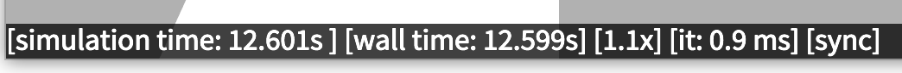

# Frequently Asked Questions

This pages provides a user guide of the library through Frequently Asked Questions (FAQ).

## What is a minimal working example of RobotDART

You can find a minimal working example at [hello_world.cpp](https://github.com/resibots/robot_dart/blob/master/src/examples/hello_world.cpp). This example is creating a world where a hexapod robot is placed just above a floor and left to fall. The robot has no actuation, and there is the simplest graphics configuration. Let's split it down.

- We first include the RobotDART headers:

{{HELLO_WORLD_INCLUDE}}

- We then load our hexapod robot:

{{HELLO_WORLD_ROBOT_CREATION}}

- We need to place it above the floor to avoid collision (position is given as a screw vector):

{{HELLO_WORLD_ROBOT_PLACING}}

- We can now create the simulation object and add the robot and the floor:

{{HELLO_WORLD_ROBOT_SIMU}}

- If needed or wanted, we can add a graphics component to visualize the scene:

{{HELLO_WORLD_ROBOT_GRAPHIC}}

- Once everything is configured, we can run our simulation for a few seconds:

{{HELLO_WORLD_ROBOT_RUN}}

- Here's how it looks:

{: style="display: block;margin-left: auto;margin-right: auto;width:70%"}

## What robots are supported in RobotDART?

RobotDART supports any robot that can be described by a URDF, SDF, SKEL or MJCF file. Nevertheless, we have a curated list of robots with edited and optimized models to be used with RobotDART (see the [robots page](robots.md) for details and examples).

## How can I load my own URDF/SDF/SKEL/MJCF file?

See the [robots page](robots.md) for details.

## How do I enable graphics in my code?

To enable graphics in your code, you need to do the following:

- Install [Magnum](http://magnum.graphics). See the [installation page](install.md) for details.
- Create and set a graphics object in the simulation object. Here's an example:

{{HELLO_WORLD_ROBOT_GRAPHIC}}


## How do I record a video?

In order to record a video of what the main camera "sees", you need to call the function `record_video(path)` of the graphics class:

{{RECORD_VIDEO_ROBOT_GRAPHICS_PARAMS}}

You can find a complete example at [talos.cpp](https://github.com/resibots/robot_dart/blob/master/src/examples/talos.cpp).

## I want to have multiple camera sensors. Is it possible?
Having multiple camera sensors is indeed possible. We can add as many cameras as we wish along the main camera defined in [How do I record a video](#how-do-i-record-a-video):
{{ADD_NEW_CAMERA}}

## How can I position a camera to the environment?
{{CAM_POSITION}}

## How can I attach a camera to a moving link?
Cameras can be easily attached to a moving link:
{{CAM_ATTACH}}
## How can I manipulate the camera?
Every camera has its own parameters, i.e a Near plane, a far plane, a Field Of View (FOV), a width and a height (that define the aspect ratio), you can manipulate each one separately:
{{MANIPULATE_CAM_SEP}}
or all at once:
{{MANIPULATE_CAM}}

You can find a complete example at [cameras.cpp](https://github.com/resibots/robot_dart/blob/master/src/examples/cameras.cpp).

## What do the numbers in the status bar mean?

The status bar looks like this:

{: style="display: block;margin-left: auto;margin-right: auto;width:70%"}

Where **simulation time** gives us the total simulated time (in seconds), **wall time** gives us the total time (in seconds) that has passed in real-time once we have started simulating. The next number **X.Xx** gives us the real-time factor: for example, **1.1x** means that the simulation runs 1.1 times faster than real-time, whereas **0.7x** means that the simulation runs slower than real-time. The value **it: XX ms** reports the time it took the last iteration (in milliseconds). The last part gives us whether the simulation tries to adhere to real-time or not. **sync** means that RobotDART will slow down the simulation in order for it to be in real-time, whereas **no-sync** means that RobotDART will try to run the simulation as fast as possible.


## How can I alter the graphics scene (e.g., change lighting conditions)?
You can disable or enable shadows:

{{SHADOWS_GRAPHICS}}

You can also add your own lights, but first you have to clear the default lights:

{{CLR_LIGHT}}

Then you must create a custom light material:

{{LIGHT_MATERIAL}}

Now you can add on ore more of the following lights:

**Point Light**:

{{POINT_LIGHT}}

**Spot Light**:

{{SPOT_LIGHT}}

**Directional Light**:

{{DIRECTIONAL_LIGHT}}

## I want to visualize a target configuration of my robot, is this possible?
{{ROBOT_GHOST}}

## How can I control my robot? Can I have a position-,velocity-,torque-controlled robot?

## Is there a way to control the simulation timestep?
When creating a RobotDARTSimu object you choose the simulation timestep:
{{INIT_SIMU}}
which can later be modified by:
{{MODIFY_SIMU_DT}}

## I want to simulate a mars environment, is it possible to change the gravitational force of the simulation environment?
Yes you can modify the gravitational forces 3-dimensional vector of the simulation:
{{SIMU_GRAVITY}}
## Which collision detectors are available? What are their differences? How can I choose between them?
| Dart | FCL | ODE | Bullet |
|------|-----|-----|--------|
|      |     |     |        |
|      |     |     |        |
|      |     |     |        |

{{SET_COLLISION_DETECTOR}}
## My robot does not self-collide. How can I change this?
One possible cause may be the fact that self collision is disabled, you can check and change this:
{{SELF_COLLISIONS}}
## How can I compute kinematic/dynamic properties of my robot (e.g., Jacobians, Mass Matrix)?

**Kinematic Properties:**

{{KINEMATICS}}

**Dynamic Properties:**

{{DYNAMICS}}

## Is there a way to change the joint or link (body) properties (e.g., actuation, mass)?
There are 6 types of actuators available, you can set the same actuator to multiple joints at once, or you can set each sensor separately:
{{SET_ACTUATOR}}
To enable position and velocity limits for the actuators:
{{POSITIONS_ENFORCED}}
Every actuators limits (position, velocity, acceleration, force) can be modified:
{{MODIFY_LIMITS}}
You can also modify the damping coefficients, coulomb frictions and spring stiffness of every joint:
{{MODIFY_COEFFS}}

## What are the supported sensors? How can I use an IMU?
#### **Torque sensor**
Torque sensors can be added to every joint of the robot:
{{TORQUE_SENSOR}}
{{TORQUE_MEASUREMENT}}
#### **Force-Torque sensor**
Force-Torque sensors can be added to every joint of the robot:
{{FORCE_TORQUE_SENSOR}}
{{FORCE_TORQUE_MEASUREMENT}}
#### **IMU sensor**
Torque sensors can be added to every link of the robot:
{{IMU_SENSOR}}
{{IMU_MEASUREMENT}}

## How can I measure forces being applied to my robot?

## How can I spawn multiple robots in parallel?

The best way to do so is to create a Robot pool. With a robot pool you:

- Minimize the overhead of loading robots (it happens only once!) or cloning robots (it never happens)
- Make sure that your robots are "clean" once released from each thread
- Focus on the important stuff rather than handling robots and threads

Let's see a more practical example:

- First we need to include the proper header:

{{ROBOT_POOL_INCLUDE}}

- Then we create a `creator` function and the pool object:

{{ROBOT_POOL_GLOBAL_NAMESPACE}}

The `creator` function is the function responsible for loading your robot. This should basically look like a standalone code to load or create a robot.

- Next, we create a few threads that utilize the robots (in your code you might be using OpenMP or TBB):

{{ROBOT_POOL_CREATE_THREADS}}

- An example evaluation function:

{{ROBOT_POOL_EVAL}}

## I need to simulate many worlds with camera sensors in parallel. How can I do this?
On [magnum_contexts.cpp](https://github.com/resibots/robot_dart/blob/master/src/examples/magnum_contexts.cpp) you can find an example showcasing the use of many worlds with camera sensors in parallel
{{CAMERAS_PARALLEL}}
## I do not know how to use waf. How can I detect RobotDART from CMake?

You need to use `waf` to build RobotDART, but when installing the library a CMake module is installed. Thus it is possible use RobotDART in your code using CMake. You can find a complete example at [cmake/example](https://github.com/resibots/robot_dart/blob/master/cmake/example). In short the CMake would look like this:

``` cmake
cmake_minimum_required(VERSION 3.10 FATAL_ERROR)
project(robot_dart_example)
# we ask for Magnum because we want to build the graphics
find_package(RobotDART REQUIRED OPTIONAL_COMPONENTS Magnum)

add_executable(robot_dart_example example.cpp)

target_link_libraries(robot_dart_example
   RobotDART::Simu
)

if(RobotDART_Magnum_FOUND)
  add_executable(robot_dart_example_graphics example.cpp)
  target_link_libraries(robot_dart_example_graphics
    RobotDART::Simu
    RobotDART::Magnum
  )
endif()
```

## I prefer coding in python. How can I use RobotDART?

RobotDART comes with python bindinds. Please refer to the [installation page](install.md) to see how to install them. Once the python bindings are installed, we can use RobotDART from python! An example is available at [example.py](https://github.com/resibots/robot_dart/blob/master/src/python/example.py). There is mostly an one-to-one mapping between C++ and python objects and functions.