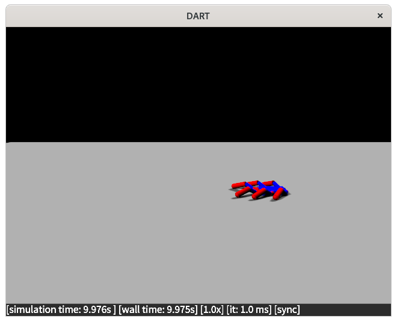

# Frequently Asked Questions

This pages provides a user guide of the library through Frequently Asked Questions (FAQ).

## What is a minimal working example of RobotDART

You can find a minimal working example at [hello_world.cpp](https://github.com/resibots/robot_dart/blob/master/src/examples/hello_world.cpp). This example is creating a world where a hexapod robot is placed just above a floor and left to fall. The robot has no actuation, and there is the simplest graphics configuration. Let's split it down.

- We first include the RobotDART headers:

{{HELLO_WORLD_INCLUDE}}

- We then load our hexapod robot:

{{HELLO_WORLD_ROBOT_CREATION}}

- We need to place it above the floor to avoid collision (position is given as a screw vector):

{{HELLO_WORLD_ROBOT_PLACING}}

- We can now create the simulation object and add the robot and the floor:

{{HELLO_WORLD_ROBOT_SIMU}}

- If needed or wanted, we can add a graphics component to visualize the scene:

{{HELLO_WORLD_ROBOT_GRAPHIC}}

- Once everything is configured, we can run our simulation for a few seconds:

{{HELLO_WORLD_ROBOT_RUN}}

- Here's how it looks:

{: style="display: block;margin-left: auto;margin-right: auto;width:70%"}

## What robots are supported in RobotDART?

RobotDART supports any robot that can be described by a URDF, SDF, SKEL or MJCF file. Nevertheless, we have a curated list of robots with edited and optimized models to be used with RobotDART (see the [robots page](robots.md) for details and examples).

## How can I load my own URDF/SDF/SKEL/MJCF file?

See the [robots page](robots.md) for details.

## How do I enable graphics in my code?

To enable graphics in your code, you need to do the following:

- Install [Magnum](http://magnum.graphics). See the [installation page](install.md) for details.
- Create and set a graphics object in the simulation object. Here's an example:

{{HELLO_WORLD_ROBOT_GRAPHIC}}

## How do I record a video?

## How can I manipulate the camera?

## How can I display debug information?

## What do the numbers in the status bar mean?

## How can I visualize the state of my model?

## Can I add change the graphics scene (e.g., change lighting conditions)?

## How can I control my robot? Can I have a position-,velocity-,torque-controlled robot?

## Is there a way to control the simulation timestep?

## What is the difference between the DART and the FCL collision detector? How can I choose between them?

## My robot does not self-collide. How can I change this?

## How can I compute kinematic/dynamic properties of my robot (e.g., Jacobians, Mass Matrix)?

## Is there a way to change the joint or link (body) properties (e.g., actuation, mass)?

## What are the supported sensors? How can I use an IMU?

## I want to have multiple camera sensors. Is it possible? How can I attach a camera to a moving link?

## How can I measure forces being applied to my robot?

## How can I spawn multiple robots in parallel?

## I need to simulate many worlds with camera sensors in parallel. How can I do this?

## I do not know how to use waf. How can I detect RobotDART from CMake?

## I prefer coding in python. How can I use RobotDART?
