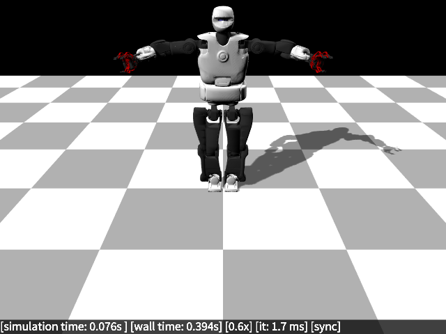
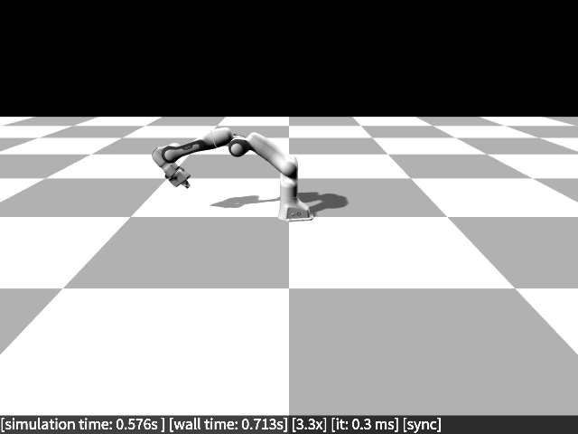
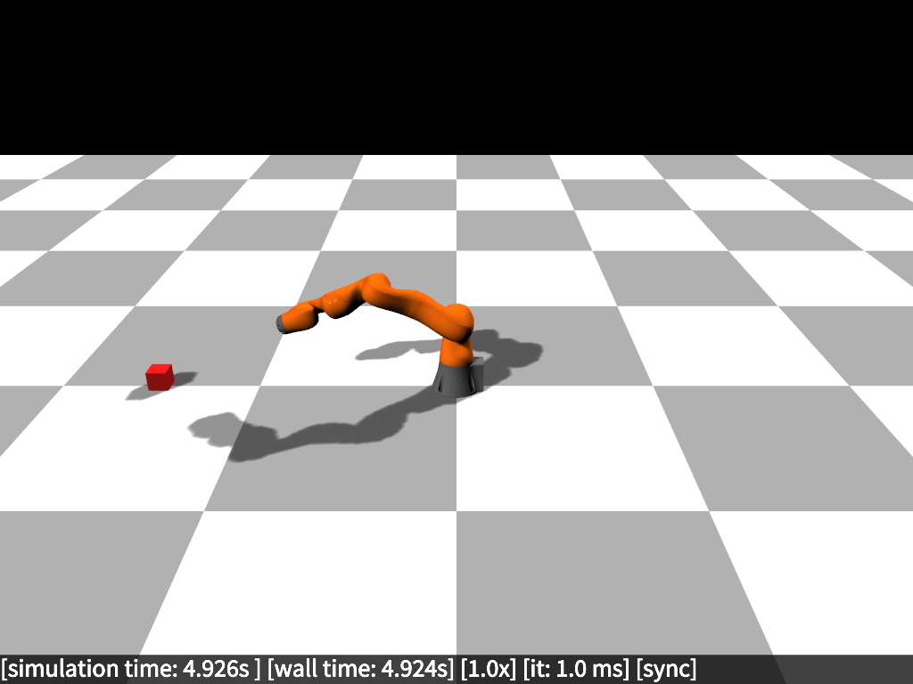
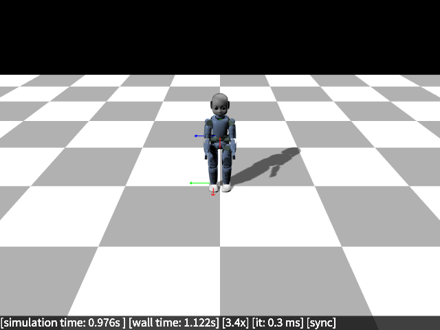
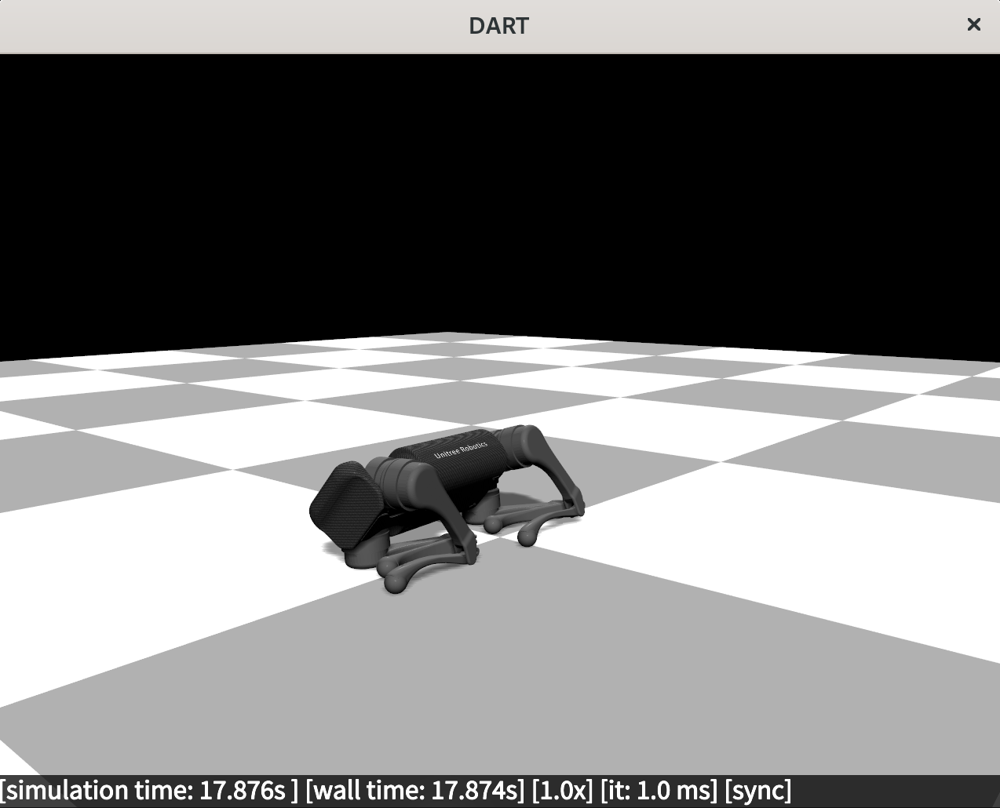
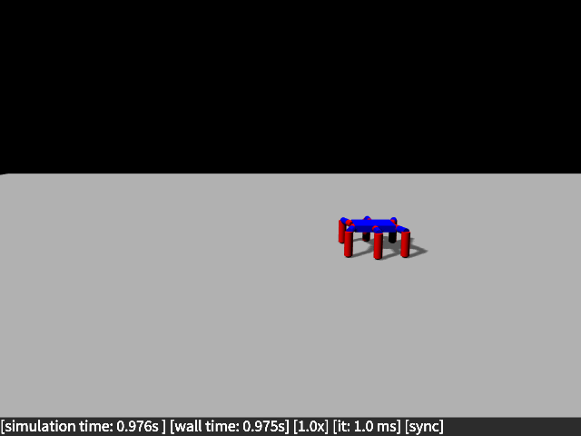
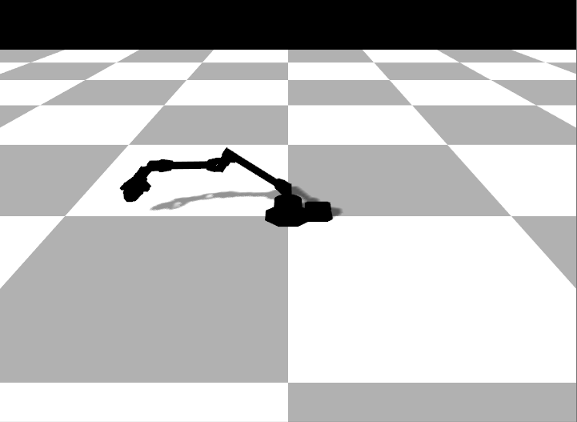
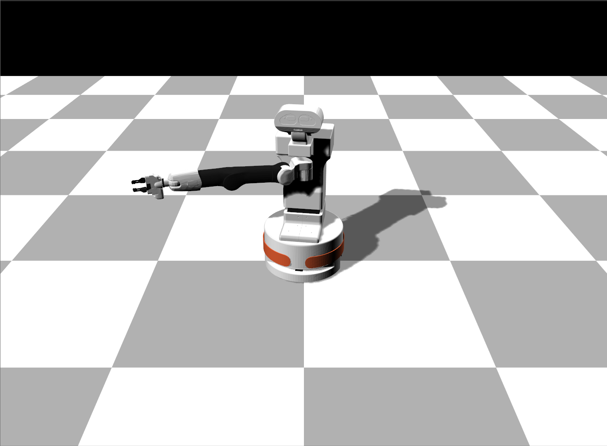
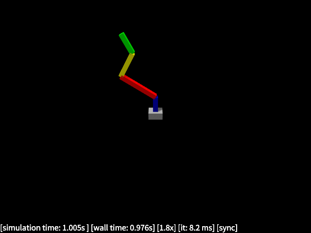

---
  hide:
    -navigation
---
<style>
  .md-typeset h1,
  .md-content__button {
    display: none;
  }
</style>
# Supported robots

Every robot is a defined as a URDF, which will be installed `$PREFIX/share/utheque`. All robots have pre-defined "robot classes" that define sensors and other properties; for your custom/new robots, you will have to add the sensors/properties via the generic robot class (or create a new robot class).

The URDF files are loaded using the following rules (see `utheque::path()`):

- First check in the current directory
- If not found, check in `current_directory/utheque`
- If not found, check in `$ROBOT_DART_PATH/utheque`
- If not found, check in the robot dart installation path/robots (e.g., `/usr/share/utheque` or `$HOME/share/utheque`)
- Otherwise, report failure

`utheque` is a separate header-only library that gets installed together with RobotDART (or even alone), that can be used in libraries that do not want to interfere with RobotDART and use the curated URDF files.

## Talos (PAL Robotics)
{: style="display: block;margin-left: auto;margin-right: auto;width:70%"}

Talos is a humanoid robot made by [PAL Robotics](https://pal-robotics.com/robots/talos/).

- Datasheet: [[pdf](https://pal-robotics.com/wp-content/uploads/2019/07/Datasheet_TALOS.pdf)]
- 32 degrees of freedom (6 for each leg, 7 for each arm, 2 for the waist, 2 for the neck, 1 for each gripper)
- 175 cm / 95 kg
- IMU in the torso
- Torque sensors in all joints except head, wrist and gripper (22 torque sensors total)
- 1 force/torque sensor in each ankle
- 1 force/torque sensor in each wrist

We have two URDF files:

- `utheque/talos/talos.urdf` :
    * accurate (simplified but made of polygons) collision meshes
    * mimic joints for the gripper
    * Not compatible the DART collision detector (you need to use FCL collision detector - shipped with DART)
    * URDF: [[talos.urdf](https://github.com/resibots/robot_dart/blob/master/utheque/talos/talos.urdf)]
    * Example: [[talos.cpp](https://github.com/resibots/robot_dart/blob/master/src/examples/talos.cpp)] [[talos.py](https://github.com/resibots/robot_dart/blob/master/src/examples/python/talos.py)]

!!! note "Load Talos"
    === "C++"
{{TALOS}}
    === "Python"
{{TALOS_PYTHON}}

- `utheque/talos/talos_fast.urdf`:
    * no collision except for the feet, which are approximated by boxes
    * grippers are fixed (no movement is allowed)
    * compatible with the DART collision detector
    * URDF: [[talos_fast.urdf](https://github.com/resibots/robot_dart/blob/master/utheque/talos/talos_fast.urdf)]
    * Example: [[talos_fast.cpp](https://github.com/resibots/robot_dart/blob/master/src/examples/talos_fast.cpp)]

`talos_fast.urdf` is faster because it makes it possible to use the DART collision detector (and has much collision shapes). You should prefer it except if you want to use the grippers (e.g., for manipulation) or are working on self-collisions.

- `utheque/talos/talos_fast_collision.urdf`:
    * all bodies are approximated by boxes
    * grippers are fixed (no movement is allowed)
    * compatible with the DART collision detector
    * URDF: [[talos_fast_collision.urdf](https://github.com/resibots/robot_dart/blob/master/utheque/talos/talos_fast.urdf)]
    * Example: [[talos_fast_collision.cpp](https://github.com/resibots/robot_dart/blob/master/src/examples/talos_fast_collision.cpp)] [[talos_fast_collision.py](https://github.com/resibots/robot_dart/blob/master/src/examples/python/talos_fast_collision.py)]

`talos_fast_collision.urdf` is faster than `talos.urdf` but slower than `talos_fast.urdf`. You should use it when you need more detail collisions but faster simulation times.

!!! note "Load Talos Fast"
    === "C++"
{{TALOS_FAST}}
    === "Python"
{{TALOS_FAST_PYTHON}}

*Please note that the mesh files (.glb) require assimp 5.x (and not assimp4.x usually shipped with ROS). If you cannot load the URDF, please check your assimp version.*

## Panda (Franka Emika)
{: style="display: block;margin-left: auto;margin-right: auto;width:70%"}

The Franka is a modern manipulator made by [Franka Emika Panda](https://www.franka.de/technology). It is commonly found in many robotics labs.

- Datasheet: [[pdf](https://www.generationrobots.com/media/panda-franka-emika-datasheet.pdf)]
- 7 degrees of freedom
- Can be controlled in torque
- 18 kg
- workspace: 855 mm (horizontal), 1190 mm (vertical)
- URDF: [[franka.urdf](https://github.com/resibots/robot_dart/blob/master/utheque/franka/franka.urdf)]
- Example: [[franka.cpp](https://github.com/resibots/robot_dart/blob/master/src/examples/franka.cpp)] [[franka.py](https://github.com/resibots/robot_dart/blob/master/src/examples/python/franka.py)]
The URDF includes the gripper.
!!! note "Load Franka"
    === "C++"
{{FRANKA}}
    === "Python"
{{FRANKA_PYTHON}}

## LBR iiwa (KUKA)
{: style="display: block;margin-left: auto;margin-right: auto;width:70%"}

The LBR iiwa is manufactured by [KUKA](https://www.kuka.com/en-de/products/robot-systems/industrial-robots/lbr-iiwa). It is similar to the Panda and is also very common in robotics labs.

- Datasheet: [[pdf](https://www.kuka.com/-/media/kuka-downloads/imported/6b77eecacfe542d3b736af377562ecaa/db_lbr_iiwa_en.pdf?rev=70ca3521eecc42b9b1a05d0e486119ba&hash=C3DDC2EFE649EFDF75E592892C466D6F)]
- We implement the 14 kg version
- 29.5 kg
- 7 degrees of freedom
- URDF: [[iiwa.urdf](https://github.com/resibots/robot_dart/blob/master/utheque/iiwa/iiwa.urdf)]
- Example: [[iiwa.cpp](https://github.com/resibots/robot_dart/blob/master/src/examples/iiwa.cpp)] [[iiwa.py](https://github.com/resibots/robot_dart/blob/master/src/examples/python/iiwa.py)]

!!! note "Load Iiwa"
    === "C++"
{{IIWA}}
    === "Python"
{{IIWA_PYTHON}}

## iCub (IIT)
{: style="display: block;margin-left: auto;margin-right: auto;width:70%"}

The iCub is a open source humanoid robot made by the [Instituto Italiano di Tecnologia](https://icub.iit.it). There are currently 42 iCUbs in the world, and many versions.

- Datasheet (rev 2.3) [[pdf](https://icub.iit.it/storage/documents/Technical-specs_iCub_robot_Rev_2.3_05082019.pdf)]
- 6 force/torque sensors (upper arms, upper legs, ankles)
- IMU in the head
- We do to simulate the skin
- We do not simulate the hands
- Our model is close to the [Inria's iCub](https://members.loria.fr/JBMouret/robots.html), but it has not been checked in detail.
- URDF: [[icub.urdf](https://github.com/resibots/robot_dart/blob/master/utheque/iiwa/icub.urdf)]
- Example [[icub.cpp](https://github.com/resibots/robot_dart/blob/master/src/examples/icub.cpp)] [[icub.py](https://github.com/resibots/robot_dart/blob/master/src/examples/python/icub.py)]

*Please note that the mesh files (.glb) require assimp 5.x (and not assimp4.x usually shipped with ROS). If you cannot load the URDF, please check your assimp version.*
!!! note "Load iCub"
    === "C++"
{{LOAD_IICUB}}
    === "Python"
{{LOAD_IICUB_PYTHON}}

!!! note "Print IMU sensor measurements"
    === "C++"
{{ICUB_PRINT_IMU}}
    === "Python"
{{ICUB_PRINT_IMU_PYTHON}}

!!! note "Print Force-Torque sensor measurements"
    === "C++"
{{ICUB_PRINT_FT}}
    === "Python"
{{ICUB_PRINT_FT_PYTHON}}
## Unitree A1
{: style="display: block;margin-left: auto;margin-right: auto;width:70%"}

A1 is a quadruped robot made by the [Unitree Robotics](https://www.unitree.com/products/a1/).

<!-- - Depth camera in the head -->
- IMU in the torso
- We do not simulate the foot pressure sensors (yet)
- One can easily add a depth camera on the head
- URDF: [[a1.urdf](https://github.com/resibots/robot_dart/blob/master/utheque/unitree_a1/a1.urdf)]
- Example [[a1.cpp](https://github.com/resibots/robot_dart/blob/master/src/examples/a1.cpp)] [[a1.py](https://github.com/resibots/robot_dart/blob/master/src/examples/python/a1.py)]
!!! note "Load A1"
    === "C++"
{{A1}}
    === "Python"
{{A1_PYTHON}}


!!! note "Print IMU sensor measurements"
    === "C++"
{{A1_PRINT_IMU}}
    === "Python"
{{A1_PRINT_IMU_PYTHON}}

!!! note "Add a depth camera on the head"
    [How can I attach a camera to a moving link?](../faq/#how-can-i-attach-a-camera-to-a-moving-link)

*Please note that the mesh files (.glb) require assimp 5.x (and not assimp4.x usually shipped with ROS). If you cannot load the URDF, please check your assimp version.*

## Dynamixel-based hexapod robot (Inria and others)
{: style="display: block;margin-left: auto;margin-right: auto;width:70%"}

This hexapod is a simple 6-legged robot based on dynamixel actuators. It is similar to the robot used in the paper [`Robots that can adapt like animals'](https://www.nature.com/articles/nature14422) (Cully et al., 2015).

- 6 legs, 3 degrees of freedom for each leg (18 degrees of freedom)
- simple URDF (no meshes)
- URDF: [[pexod.urdf](https://github.com/resibots/robot_dart/blob/master/utheque/pexod.urdf)]
- Example: [[hexapod.cpp](https://github.com/resibots/robot_dart/blob/master/src/examples/hexapod.cpp)] [[hexapod.py](https://github.com/resibots/robot_dart/blob/master/src/examples/python/hexapod.py)]

!!! note "Load Hexapod"
    === "C++"
{{HEXAPOD}}
    === "Python"
{{HEXAPOD_PYTHON}}


!!! note "Load Pexod"
    === "C++"
{{HELLO_WORLD_ROBOT_CREATION}}
    === "Python"
{{HELLO_WORLD_ROBOT_CREATION_PYTHON}}

## Vx-300
{: style="display: block;margin-left: auto;margin-right: auto;width:70%"}

The ViperX-300 is a versatile robotic arm developed by [Interbotix](https://docs.trossenrobotics.com/interbotix_xsarms_docs/specifications/vx300.html). It is designed for a range of applications including education, research, and light industrial tasks.

- 5 degrees of freedom plus a gripper
- URDF: [[vx300.urdf](https://github.com/NOSALRO/robot_dart/blob/master/utheque/vx300/vx300.urdf)]
- Example: [[vx300.cpp](https://github.com/resibots/robot_dart/blob/master/src/examples/vx300.cpp)] [[vx300.py](https://github.com/resibots/robot_dart/blob/master/src/examples/python/vx300.py)]

!!! note "Load Vx-300"
    === "C++"
{{VX300}}
    === "Python"
{{VX300_PYTHON}}


## Tiago (PAL Robotics)
{: style="display: block;margin-left: auto;margin-right: auto;width:70%"}

Tiago is a mobile manipulator robot developed by [PAL Robotics](https://pal-robotics.com/robots/tiago/), designed for tasks such as navigation, object manipulation, and human-robot interaction.

- Datasheet: [pdf](https://pal-robotics.com/wp-content/uploads/2024/04/Datasheet-TIAGo.pdfs)
- Height: 110 - 145 cm
- Weight: 70 kg
- Degrees of Freedom (DoF): 7 (Arm), 2 (Head), 2 (Mobile Base)
- Force/Torque sensor in the gripper
- URDF: [[tiago.urdf](https://github.com/NOSALRO/robot_dart/blob/master/utheque/tiago/tiago_steel.urdf)]
- Example: [[tiago.cpp](https://github.com/resibots/robot_dart/blob/master/src/examples/tiago.cpp)] [[tiago.py](https://github.com/resibots/robot_dart/blob/master/src/examples/python/tiago.py)]

!!! note "Load Tiago"
    === "C++"
{{TIAGO}}
    === "Python"
{{TIAGO_PYTHON}}


## Simple arm
{: style="display: block;margin-left: auto;margin-right: auto;width:70%"}

- A simple arm for educational or debugging purposes
- 5 degrees of freedom
- simple URDF (no meshes)
- URDF: [[arm.urdf](https://github.com/resibots/robot_dart/blob/master/utheque/arm.urdf)]
- Example: [[arm.cpp](https://github.com/resibots/robot_dart/blob/master/src/examples/arm.cpp)] [[arm.py](https://github.com/resibots/robot_dart/blob/master/src/examples/python/arm.py)]

!!! note "Load Simple Arm"
    === "C++"
{{SIMPLE_ARM}}
    === "Python"
{{SIMPLE_ARM_PYTHON}}

## Loading Custom Robots
RobotDART gives you the ability to load custom robots  that are defined in [URDF](http://wiki.ros.org/urdf/Tutorials), [SDF](https://classic.gazebosim.org/tutorials?tut=build_model#ComponentsofSDFModels), [SKEL](https://dartsim.github.io/skel_file_format.html) or [MJCF](https://mujoco.readthedocs.io/en/latest/modeling.html#mjcf-mechanisms) files. For example, you can load a urdf model using:

!!! note "Load custom Robot"
    === "C++"
    ``` C++
        auto your_robot = std::make_shared<robot_dart::Robot>("path/to/model.urdf");
    ```
    === "Python"
    ``` Python
        your_robot = robot_dart.Robot("path/to/model.urdf")
    ```
!!! note "Load custom Robot with packages (e.g STL, DAE meshes)"
    === "C++"
    ``` C++
        std::vector<std::pair<std::string, std::string>> your_model_packages = {{"model", "path/to/model/dir"}};
        auto your_robot = std::make_shared<robot_dart::Robot>("path/to/model.urdf", your_model_packages, "packages");
    ```
    === "Python"
    ``` Python
        your_model_packages = [("model", "path/to/model/dir")]
        your_robot = robot_dart.Robot("path/to/model.urdf", your_model_packages)
    ```

